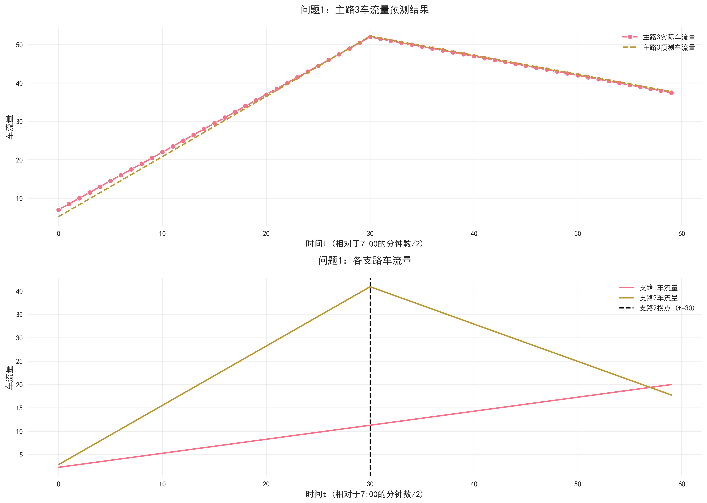
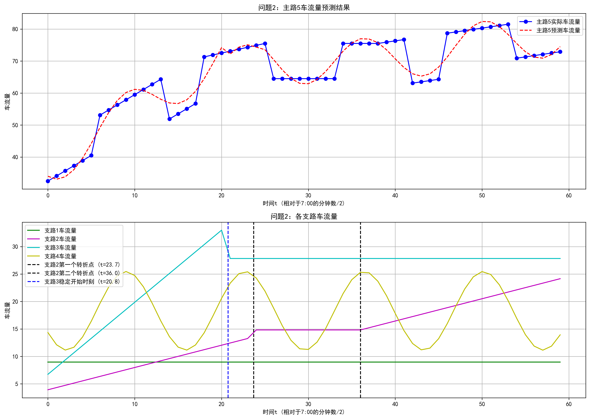
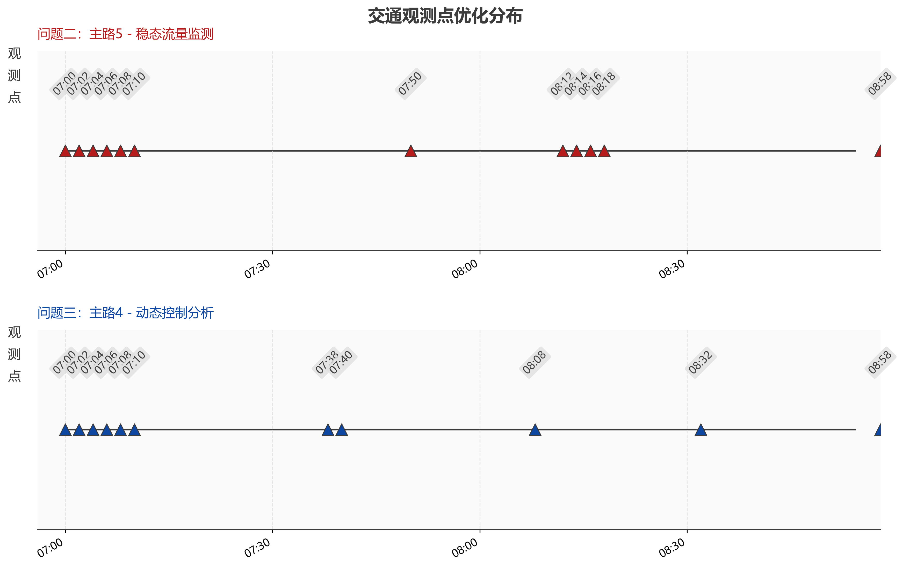

# 支路汇入型道路车流量建模与预测

[](https://doi.org/10.12677/mos.2026.151009)
[](https://www.python.org/)
[](LICENSE)
[](https://creativecommons.org/licenses/by/4.0/)

本仓库是论文《支路汇入型道路车流量模型构建与预测研究》的开源整理版，包含建模代码、竞赛附件数据、代表性结果和复现说明。项目研究如何仅利用主路监测数据，反演多条支路的车流量变化，并进一步用贪心策略减少必要的采样时刻。

> 刘雪剑，李怡馨，罗子健. 支路汇入型道路车流量模型构建与预测研究[J]. 建模与仿真, 2026, 15(1): 93-103. DOI: [10.12677/mos.2026.151009](https://doi.org/10.12677/mos.2026.151009)

## 研究内容

- 双支路汇入：用线性函数与分段线性函数描述支路流量，并根据主路流量守恒关系估计参数。
- 四支路汇入：组合常数、分段线性、增长后稳定和周期函数，并考虑 2 分钟传播延迟。
- 信号控制场景：描述红绿灯周期对支路流量的分段影响。
- 采样优化：通过贪心选择关键观测时刻，在控制预测误差的前提下减少监测次数。

## 结果示例

| 双支路拟合 | 四支路拟合 | 采样时刻优化 |
|---|---|---|
|  |  |  |

## 仓库结构

```text
.
├── assets/              # README 展示图
├── data/                # 2025 五一数学建模竞赛 A 题附件
├── docs/                # 方法、数据与复现说明
├── outputs/generated/   # 运行脚本后生成的结果（默认不提交）
├── paper/               # 已发表论文 PDF
├── src/                 # 各问题的建模与优化脚本
├── CITATION.cff         # GitHub 引用元数据
├── LICENSE              # 代码许可证
└── requirements.txt     # Python 依赖
```

## 快速开始

```bash
git clone https://github.com/fangjianzhi/road-traffic-flow-prediction.git
cd road-traffic-flow-prediction

python -m venv .venv
# Windows: .venv\Scripts\activate
# macOS/Linux: source .venv/bin/activate

python -m pip install -r requirements.txt
python src/problem_1_dual_branch.py
```

脚本会把图片、文本结果和交互式图表写入 `outputs/generated/`。其余入口见[复现指南](docs/REPRODUCIBILITY.md)。部分全局优化脚本计算量较大，运行时间取决于 CPU 与 SciPy 版本。

## 论文与引用

- [阅读已发表论文](paper/published-article.pdf)
- [查看论文元数据与 BibTeX](docs/PUBLICATION.md)
- GitHub 页面右侧的 **Cite this repository** 可直接读取 `CITATION.cff`。

如果本仓库对你的研究有帮助，请优先引用正式发表的论文。

## 数据与许可

研究问题和附件数据来源于 2025 年第二十二届“五一”数学建模竞赛 A 题。数据来源、字段与使用边界见 [docs/DATA.md](docs/DATA.md)。

- 本仓库源代码采用 [MIT License](LICENSE)。
- 已发表论文由作者与出版社按 [CC BY 4.0](https://creativecommons.org/licenses/by/4.0/) 发布。
- 竞赛题目与附件的权利仍归原权利方；本仓库中的附件仅用于研究复现与教学交流。

## 致谢

感谢“五一”数学建模竞赛组委会提供研究问题与数据。论文受中央高校基本科研业务费项目 `25CAFUC04078` 资助。
